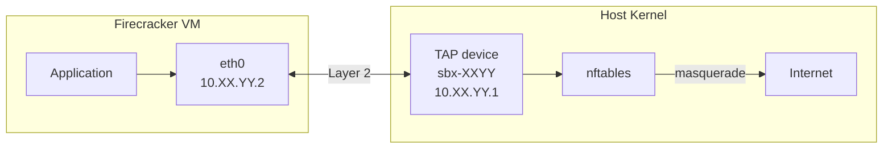
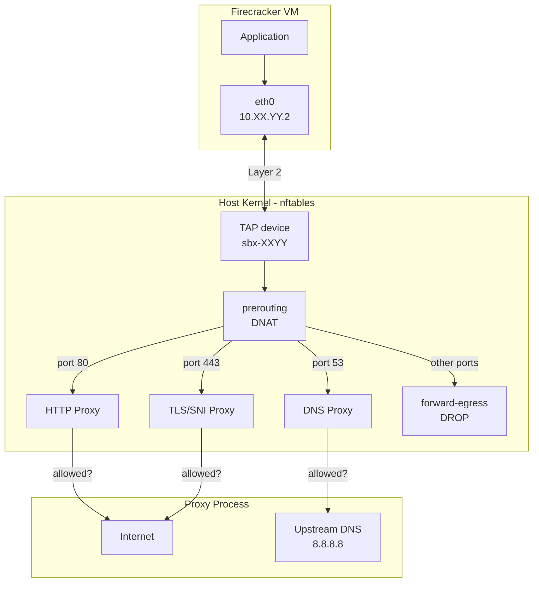
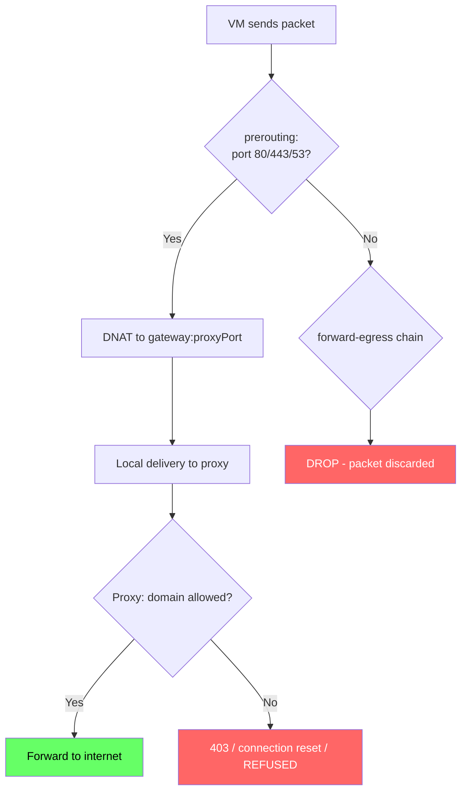
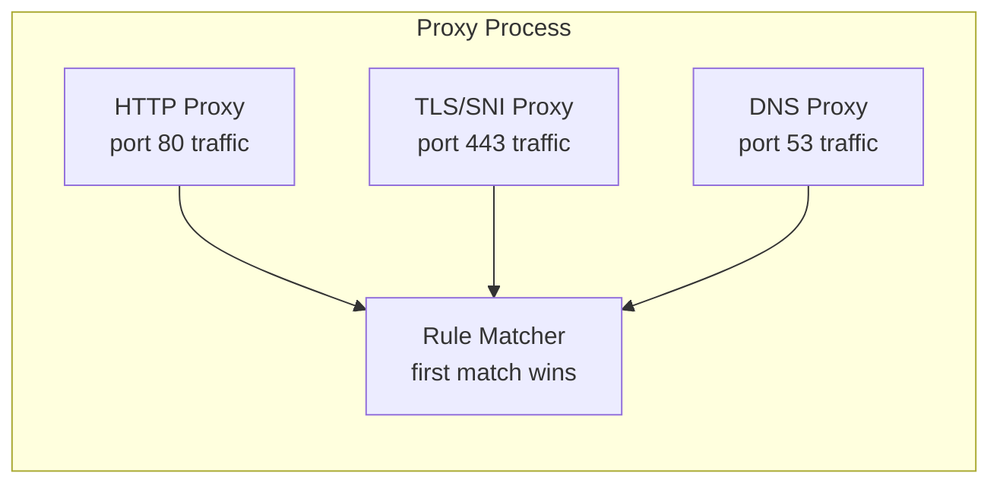
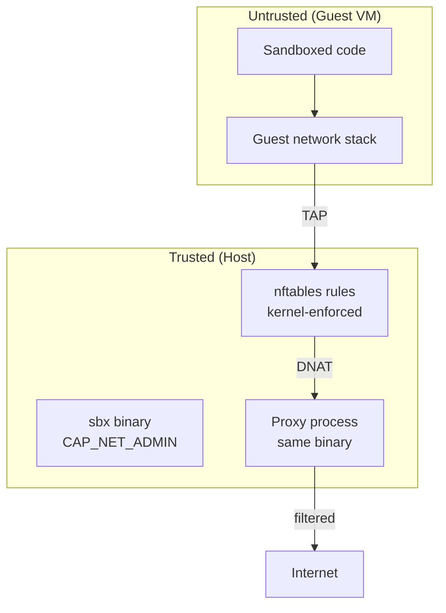
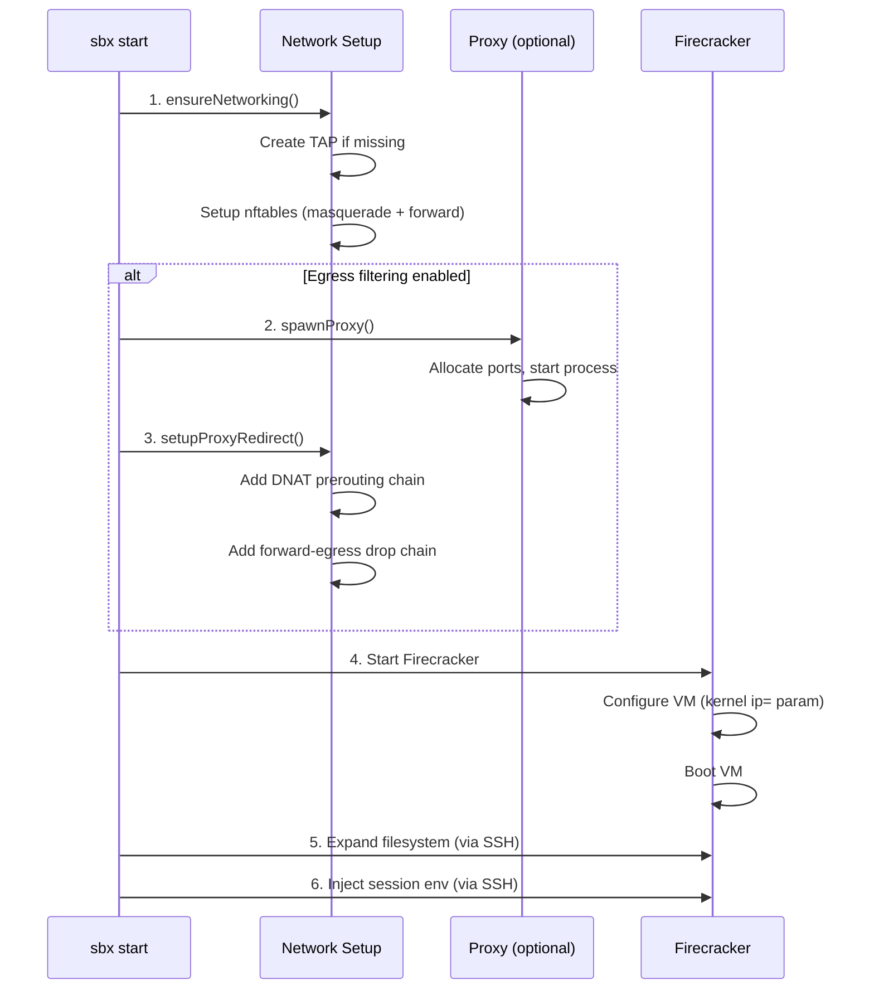

# Networking

SBX gives each Firecracker microVM its own isolated network stack connected to the host via a TAP device. Outbound traffic is NAT'd through the host, and when egress filtering is enabled, all traffic is forced through a userspace proxy that enforces domain-based rules at the HTTP, TLS, and DNS layers.

This document covers the full networking design: how the network is set up, how egress filtering works, the security model, and how to debug issues.

## Architecture Overview



When egress filtering is active, the picture changes — traffic on ports 80, 443, and 53 is redirected to a proxy before it can leave:



## Network Allocation

Each sandbox gets a deterministic network configuration derived from its unique ID. This means the same sandbox always gets the same IP, MAC, and TAP device name — even across restarts.

The allocation uses `SHA256(sandboxID)` and takes the first two bytes (`XX`, `YY`):

| Parameter | Value | Example |
|---|---|---|
| TAP device | `sbx-XXYY` | `sbx-a3f2` |
| Gateway (host side) | `10.XX.YY.1` | `10.163.242.1` |
| VM IP (guest side) | `10.XX.YY.2` | `10.163.242.2` |
| Subnet | `10.XX.YY.0/24` | `10.163.242.0/24` |
| MAC address | `06:00:0A:XX:YY:02` | `06:00:0A:A3:F2:02` |

> **Source**: `internal/sandbox/firecracker/engine.go:335-345`

### TAP Device

The TAP device is created using the `netlink` Go library (not shell commands). It runs in `TUNTAP_MODE_TAP` mode with `TUNTAP_NO_PI` (no packet info header). The device is owned by the current user's UID/GID so Firecracker can open it without root.

The gateway IP is assigned to the TAP interface with a `/24` netmask, making the host reachable from the VM at `10.XX.YY.1`.

> **Source**: `internal/sandbox/firecracker/network.go:28-93`

### VM IP Configuration

The VM gets its IP address via the **kernel `ip=` boot parameter** — not DHCP:

```
ip=10.XX.YY.2::10.XX.YY.1:255.255.255.0::eth0:off
```

Format: `ip=<client-ip>::<gateway>:<netmask>::<device>:<autoconf>`.

This approach works because the Linux kernel configures the interface before init runs. No DHCP server is needed, and it works for any guest distro.

> **Source**: `internal/sandbox/firecracker/vmconfig.go:147-155`

## nftables Rules

SBX creates an `sbx` table in the IPv4 family. Rules are applied using the `google/nftables` Go library, which communicates with the kernel via netlink (requires `CAP_NET_ADMIN`).

### Base Rules (Always Present)

These rules are created during `sbx start` for every sandbox, regardless of egress filtering.

**Postrouting chain** (NAT, masquerade):

```
table ip sbx {
    chain postrouting {
        type nat hook postrouting priority srcnat;
        ip saddr 10.XX.YY.0/24 masquerade
    }
}
```

This masquerades outbound VM traffic so it appears to come from the host's IP.

**Forward chain** (filter, priority 0):

```
table ip sbx {
    chain forward {
        type filter hook forward priority filter;
        iifname "sbx-XXYY" accept    # VM -> internet
        oifname "sbx-XXYY" accept    # internet -> VM (return traffic)
    }
}
```

These rules allow the VM to send and receive traffic through the host.

> **Source**: `internal/sandbox/firecracker/network.go:155-311`

### Docker Compatibility

When Docker is installed, it creates a `FORWARD` chain with `policy drop` that blocks all forwarded traffic by default. Docker provides a `DOCKER-USER` chain specifically for user rules — packets pass through `DOCKER-USER` before Docker's own rules.

If SBX detects the `DOCKER-USER` chain in the `filter` table, it adds the forwarding accept rules there instead of creating its own forward chain. This ensures VM traffic isn't dropped by Docker's default policy.

> **Danger**: If Docker is installed after a sandbox is created, the sandbox's network will break until it's restarted (so the rules get re-created in `DOCKER-USER`). Symptoms: the VM can't reach the internet, SSH connections from the host to the VM work fine.

> **Source**: `internal/sandbox/firecracker/network.go:219-256, 315-330`

### Egress Filtering Rules (When Enabled)

When a session has an `egress:` configuration, two additional chains are created:

**Prerouting chain** (DNAT):

```
table ip sbx {
    chain prerouting {
        type nat hook prerouting priority dstnat;
        iifname "sbx-XXYY" ip saddr 10.XX.YY.2 tcp dport 80  dnat to 10.XX.YY.1:<http-port>
        iifname "sbx-XXYY" ip saddr 10.XX.YY.2 tcp dport 443 dnat to 10.XX.YY.1:<tls-port>
        iifname "sbx-XXYY" ip saddr 10.XX.YY.2 udp dport 53  dnat to 10.XX.YY.1:<dns-port>
        iifname "sbx-XXYY" ip saddr 10.XX.YY.2 tcp dport 53  dnat to 10.XX.YY.1:<dns-port>
    }
}
```

This rewrites the destination of HTTP, HTTPS, and DNS traffic to the proxy process running on the gateway IP. After DNAT, these packets are delivered locally to the proxy (they never enter the forward chain).

**Forward-egress chain** (drop non-standard ports):

```
table ip sbx {
    chain forward-egress {
        type filter hook forward priority -1;    # runs before the 'forward' chain (priority 0)
        iifname "sbx-XXYY" drop
    }
}
```

This chain drops ALL forwarded traffic from the VM. Since DNAT'd traffic (ports 80, 443, 53) is delivered locally and never reaches the forward hook, only non-standard port traffic is affected. The priority of -1 ensures this chain is evaluated before the permissive forward chain at priority 0.

> **Source**: `internal/sandbox/firecracker/network.go:422-574`

### Packet Flow with Egress Filtering



## Egress Filtering

Egress filtering is enabled by providing a session YAML file with an `egress:` section when starting a sandbox:

```bash
sbx start my-sandbox -f session.yaml
```

When enabled, SBX spawns a proxy process and sets up DNAT rules to force all HTTP, HTTPS, and DNS traffic through it. All other ports are dropped at the kernel level.

### How It Gets Enabled

The `egress:` block in a session YAML file defines the filtering policy:

```yaml
name: my-session
egress:
  default: deny          # or "allow"
  rules:
    - domain: "github.com"
      action: allow
    - domain: "*.github.com"
      action: allow
    - domain: "*.evil.com"
      action: deny
```

- **`default`**: The action taken when no rule matches (`allow` or `deny`).
- **`rules`**: Evaluated in order, **first match wins**. Each rule has a `domain` and an `action`.
- **Domain patterns**:
  - `"github.com"` — exact match only.
  - `"*.github.com"` — matches any subdomain (`api.github.com`, `a.b.github.com`) but NOT `github.com` itself.
  - `"*"` — matches everything (catch-all).

If there is no `egress:` section, no proxy is spawned, no DNAT rules are created, and the VM has unrestricted internet access.

> **Source**: `internal/model/sandbox.go:49-94`, `internal/proxy/rules.go`

### The Proxy Process

The proxy is the same `sbx` binary, run as a hidden subcommand:

```bash
sbx --no-log internal-vm-proxy \
    --port <http-port> \
    --tls-port <tls-port> \
    --dns-port <dns-port> \
    --default-policy allow \
    --rule '{"action":"deny","domain":"*.github.com"}' \
    --rule '{"action":"deny","domain":"github.com"}'
```

It runs as a background process on the host. Its PID is saved to `proxy.pid` and its ports to `proxy.json` in the VM directory (`~/.sbx/vms/<id>/`). Logs go to `proxy.log`.

The proxy consists of three components, each handling a different protocol:



#### HTTP Proxy

Handles plain HTTP requests (port 80). Works as a standard forward proxy:

- **Plain HTTP** (`GET http://example.com/`): Extracts domain from the `Host` header, checks against rules. If allowed, forwards the request upstream via `http.Transport`. If denied, returns `403 Forbidden`.
- **CONNECT tunnel** (`CONNECT example.com:443`): Extracts domain from the CONNECT target, checks rules. If allowed, hijacks the connection and creates a bidirectional TCP tunnel. If denied, returns `403 Forbidden`.
- **IP addresses always blocked**: If the target is a raw IP address (e.g., `CONNECT 140.82.121.3:443`), the proxy returns `403` immediately without consulting rules. Domain-based rules cannot be evaluated for IPs.

> **Source**: `internal/proxy/proxy.go`

#### TLS/SNI Proxy

Handles HTTPS traffic (port 443). This is a **transparent** proxy — the client does not know a proxy exists. No MITM, no certificate replacement.

How it works:

1. Accepts the raw TCP connection (DNAT'd from port 443).
2. Peeks at the TLS ClientHello to extract the SNI (Server Name Indication) field.
3. Checks the SNI domain against rules.
4. If **allowed**: Dials the real destination on port 443, replays the ClientHello bytes, and creates a bidirectional tunnel. The TLS handshake completes directly between the client and the real server.
5. If **denied**: Closes the connection (client sees connection reset).

The SNI extraction uses Go's `tls.Server` with a `GetConfigForClient` callback to capture `hello.ServerName`, then aborts the handshake. This reuses Go's battle-tested TLS parser instead of implementing manual ClientHello parsing.

> **Source**: `internal/proxy/tls.go`

#### DNS Proxy

Handles DNS queries (both UDP and TCP on port 53). Uses the `miekg/dns` library.

- Strips the trailing dot from the queried FQDN, then checks against rules.
- **Allowed**: Forwards the query to the upstream resolver (`8.8.8.8:53` by default).
- **Denied**: Returns a `REFUSED` response (rcode 5). The client gets an immediate answer — no timeout.
- **Upstream failure**: Returns `SERVFAIL`.

Both UDP and TCP DNS servers run on the same port, and both UDP 53 and TCP 53 are DNAT'd by the nftables rules. This prevents DNS-over-TCP bypass.

> **Source**: `internal/proxy/dns.go`

### Port Allocation

The proxy ports are allocated dynamically by binding to `127.0.0.1:0` and using the kernel-assigned port:

- HTTP and TLS ports: `getFreePort()` — checks TCP availability.
- DNS port: `getFreeDualPort()` — checks both TCP and UDP availability on the same port (required because the DNS proxy and DNAT rules use both protocols).

> **Source**: `internal/sandbox/firecracker/proxy.go:159-189`

## Security Model

### Trust Boundaries



- The **host** is trusted. SBX runs with `CAP_NET_ADMIN` to manage TAP devices and nftables.
- The **VM** is untrusted. All enforcement happens at the host kernel level (nftables) and in the host-side proxy process.
- The **proxy** runs on the host as a child process of `sbx`. It's the same binary, invoked via the hidden `internal-vm-proxy` subcommand.

### What the VM Cannot Do (With Egress Enabled)

| Attack Vector | How It's Blocked |
|---|---|
| Connect to arbitrary IP:port | `forward-egress` chain drops all forwarded (non-DNAT'd) traffic |
| Use raw IP to bypass domain rules | Proxy returns 403 for any IP-based request (HTTP and CONNECT) |
| Resolve blocked domains via UDP DNS | UDP 53 is DNAT'd to DNS proxy, which returns `REFUSED` |
| Resolve blocked domains via TCP DNS | TCP 53 is also DNAT'd to DNS proxy |
| Resolve blocked domains via DoH | DoH goes through HTTPS (port 443), TLS proxy checks the SNI. Even if resolved, the IP can't be used directly (proxy blocks IPs) |
| Connect on non-standard ports (SSH 22, DoT 853, etc.) | `forward-egress` drops all forwarded traffic from the TAP |
| Use CONNECT tunnel with an IP address | Proxy blocks CONNECT to IPs with 403 |

### What the VM CAN Do (With Egress Enabled)

- Make HTTP requests on port 80 to allowed domains.
- Make HTTPS requests on port 443 to allowed domains (with full TLS integrity — no MITM).
- Resolve DNS for allowed domains (both UDP and TCP).
- Communicate with the host gateway IP (for the proxy connections).

### Without Egress Filtering

When no `egress:` section is in the session config, the VM has **unrestricted internet access** through the masquerade NAT. No proxy is spawned, no DNAT rules, no forward-egress chain. The VM can connect to any IP on any port.

### Capabilities and Requirements

| Requirement | Purpose |
|---|---|
| `CAP_NET_ADMIN` | Create TAP devices, manage nftables rules |
| `/dev/kvm` access | Run Firecracker (hardware virtualization) |
| `ip_forward=1` | Enable packet forwarding between interfaces |

Set the capability on the binary:

```bash
sudo setcap cap_net_admin+ep ./bin/sbx
```

Check requirements with `sbx doctor` which validates all of the above.

## SSH Access

SBX uses SSH to execute commands inside VMs and transfer files. Each sandbox gets its own Ed25519 keypair.

### Key Lifecycle

1. **Generation** (`sbx create`): Ed25519 keypair is generated and saved to the VM directory:
   - `~/.sbx/vms/<id>/id_ed25519` (private, mode 0600)
   - `~/.sbx/vms/<id>/id_ed25519.pub` (public, mode 0644)

2. **Injection**: The public key is written into the rootfs image at `/root/.ssh/authorized_keys` using `debugfs` (from e2fsprogs). This patches the ext4 filesystem without mounting it.

3. **Connection**: SBX connects as `root@<vm-ip>` using the private key. Host key verification is disabled (`InsecureIgnoreHostKey`) because VMs are ephemeral and the host controls both sides.

> **Source**: `internal/ssh/keys.go`, `internal/sandbox/firecracker/rootfs.go:70-146`

### Command Execution

`sbx exec` has two modes:

- **Non-TTY** (default, or piped input): Uses the Go `crypto/ssh` library directly. Supports stdin/stdout/stderr piping and context cancellation.
- **TTY** (`sbx exec --tty` or `sbx shell`): Shells out to the system `ssh` binary with `-t -t` flags. This handles terminal raw mode, window resizing, and signal forwarding, which would require significant manual effort with the Go library.

Every command is wrapped to source session environment variables:

```bash
export KEY1='value1'; export KEY2='value2'; \
[ -f /etc/sbx/session-env.sh ] && . /etc/sbx/session-env.sh; \
cd '/workdir' && 'actual-command' 'arg1' 'arg2'
```

> **Source**: `internal/sandbox/firecracker/lifecycle.go:329-436`

### File Transfer

`sbx cp` uses SFTP (over the SSH connection) for file and directory transfers in both directions. Recursive directory copy preserves permissions.

> **Source**: `internal/ssh/client.go:173-450`

## Port Forwarding

`sbx forward` creates SSH-based tunnels from the host to the VM:

```bash
# Forward localhost:8080 to VM port 8080
sbx forward my-sandbox 8080

# Forward localhost:9000 to VM port 3000
sbx forward my-sandbox 9000:3000

# Forward multiple ports
sbx forward my-sandbox 8080 9000:3000
```

This is a pure SSH tunnel — no nftables or network configuration changes. The host opens a local TCP listener and for each incoming connection, creates an SSH channel to the VM. Traffic flows bidirectionally through the encrypted SSH channel.

Port forwarding works regardless of egress filtering (it's host-to-VM communication, not VM-to-internet).

> **Source**: `internal/sandbox/firecracker/lifecycle.go:486-510`, `internal/ssh/client.go:226-316`

## Lifecycle (Networking Perspective)

### `sbx create`

Networking is **allocated but not set up**. The sandbox ID determines the TAP name, IPs, and MAC, but no TAP device, nftables rules, or processes are created. The SSH keypair is generated and injected into the rootfs.

### `sbx start`

Full networking setup:



### `sbx stop`

1. Graceful shutdown via SSH (`poweroff` command inside VM).
2. Kill Firecracker process (SIGTERM, then SIGKILL).
3. Clean up proxy redirect rules (delete `prerouting` and `forward-egress` chains).
4. Kill proxy process.
5. **TAP device and base nftables rules are preserved** (for fast restart).

### `sbx rm`

Full teardown:

1. Kill Firecracker and proxy processes.
2. Delete all nftables chains (`prerouting`, `forward-egress`, then entire `sbx` table).
3. Clean up Docker-USER rules if applicable.
4. Delete TAP device.
5. Delete VM directory and SSH keys.

## Configuration Examples

### Full Network Isolation (Deny All)

```yaml
name: isolated
egress:
  default: deny
```

The VM can't reach anything. DNS queries return `REFUSED`, HTTP returns `403`, HTTPS connections are reset. Useful for fully offline workloads.

### Allowlist (Recommended for Production)

```yaml
name: secure-build
egress:
  default: deny
  rules:
    - { domain: "registry.npmjs.org", action: allow }
    - { domain: "*.npmjs.org", action: allow }
    - { domain: "pypi.org", action: allow }
    - { domain: "*.pypi.org", action: allow }
    - { domain: "*.golang.org", action: allow }
    - { domain: "github.com", action: allow }
    - { domain: "*.github.com", action: allow }
    - { domain: "*.amazonaws.com", action: allow }
```

Only explicitly listed domains are reachable. This is the strongest security posture while still allowing package managers and source control to work.

### Denylist

```yaml
name: open-with-blocks
egress:
  default: allow
  rules:
    - { domain: "*.evil.com", action: deny }
    - { domain: "malware.example.org", action: deny }
    - { domain: "*.crypto-mining.io", action: deny }
```

Everything is allowed except explicitly blocked domains. Useful when you need broad access but want to block known-bad destinations.

### With Environment Variables

```yaml
name: dev-session
env:
  NODE_ENV: development
  GIT_AUTHOR_NAME: Developer
  DATABASE_URL: postgres://localhost:5432/mydb
egress:
  default: deny
  rules:
    - { domain: "github.com", action: allow }
    - { domain: "*.github.com", action: allow }
    - { domain: "registry.npmjs.org", action: allow }
```

Environment variables are injected into the VM at start time and sourced before every command.

### No Egress Filtering

```yaml
name: unrestricted
env:
  MY_VAR: value
```

Or simply start without a session file:

```bash
sbx start my-sandbox
```

No proxy, no DNAT, no forward restrictions. Full internet access.

## Debugging

### Check VM Connectivity

```bash
# Basic HTTP
sbx exec my-sandbox -- curl -s http://example.com

# HTTPS (may need -k if CA bundle is incomplete in the VM image)
sbx exec my-sandbox -- curl -sk https://example.com

# DNS resolution (UDP and TCP)
sbx exec my-sandbox -- dig example.com +short
sbx exec my-sandbox -- dig +tcp example.com +short

# Test if a non-standard port is blocked
sbx exec my-sandbox -- bash -c 'echo test | nc -w 3 1.1.1.1 853 && echo OPEN || echo BLOCKED'
```

### Inspect Proxy State

```bash
# Check if proxy is running
cat ~/.sbx/vms/<sandbox-id>/proxy.pid | xargs ps -p

# View allocated proxy ports
cat ~/.sbx/vms/<sandbox-id>/proxy.json
# Output: {"http_port":45873,"tls_port":39029,"dns_port":38505}

# Tail proxy logs (shows allowed/denied requests in real time)
tail -f ~/.sbx/vms/<sandbox-id>/proxy.log

# Find the proxy process with its full command line
ps aux | grep internal-vm-proxy
```

### Inspect nftables Rules

```bash
# List all sbx rules
sudo nft list table ip sbx

# Check if egress filtering is active (forward-egress chain exists)
sudo nft list chain ip sbx forward-egress 2>/dev/null \
    && echo "egress active" || echo "no egress filtering"

# List DNAT prerouting rules
sudo nft list chain ip sbx prerouting 2>/dev/null

# Check Docker-USER for sbx rules
sudo nft list chain ip filter DOCKER-USER 2>/dev/null
```

### Inspect TAP Device

```bash
# List all sbx TAP devices
ip link show type tuntap | grep sbx

# Show specific TAP device with its IP
ip addr show sbx-a3f2

# Check if IP forwarding is enabled (required)
cat /proc/sys/net/ipv4/ip_forward
# Should output: 1
```

### Common Issues

| Symptom | Likely Cause | Fix |
|---|---|---|
| VM can't reach internet at all | TAP device missing (after host reboot) | `sbx stop && sbx start` to recreate |
| VM can't reach internet, SSH works | Docker `FORWARD` chain blocking | Restart sandbox so rules go to `DOCKER-USER` |
| Proxy not running after stop/start | Egress config is per-session, not persisted | Start with `-f session.yaml` again |
| `dig` works but `curl https` fails with cert error | CA bundle incomplete in VM image | Use `curl -k` or install CA certs in rootfs |
| Non-standard port blocked unexpectedly | `forward-egress` chain active | Expected with egress filtering — only 80/443/53 allowed |
| `CAP_NET_ADMIN` error on start | Binary missing capability | `sudo setcap cap_net_admin+ep ./bin/sbx` |
| Sandbox works but newly installed Docker breaks it | Docker added `FORWARD policy drop` after sbx rules were created | Restart sandbox: `sbx stop && sbx start -f session.yaml` |
